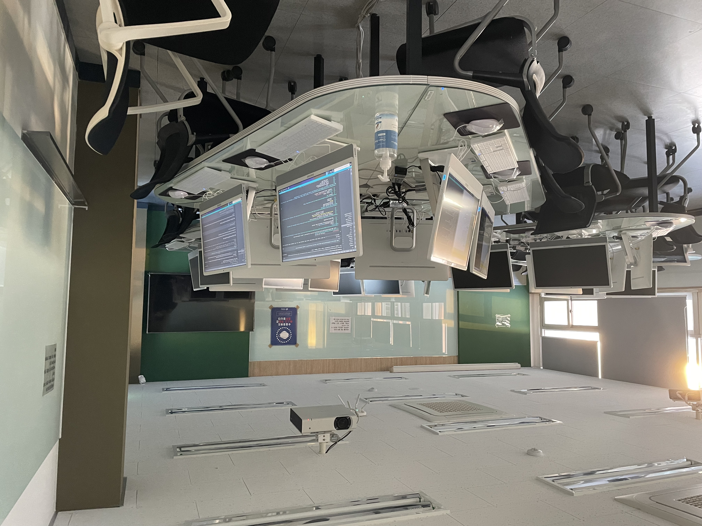

# design-system-detector

Collection of models that automatically find UI components of design systems on design screens such as Figma or Zeplin. 

I provide a collection of detection models custom trained on the UI data of [Mobbin](https://mobbin.design/), [RICO](https://interactionmining.org/rico) and [CLAY](https://github.com/google-research-datasets/clay). These models can be useful for out-of-the-box inference if you are interested in the design systems. 

They are also useful for initializing your models when training on your UI design assets. Please look at [this blog guide](https://blog.tensorflow.org/2021/01/custom-object-detection-in-browser.html) and my [Mobbin-training Colab](https://gist.github.com/dusskapark/7a6579da4d61c8156ff11d3644041b29) for more details.

| Dataset | Model name                                                   | Backbone                                                     | Training     | Note                                                         |
| ------- | ------------------------------------------------------------ | ------------------------------------------------------------ | ------------ | ------------------------------------------------------------ |
| Mobbin  | [Saved Model](./mobbin/models/mobilenetv2-50k/saved-model) [Web Model](./mobbin/models/mobilenetv2-50k/web-model) | [SSD MobileNet V2 FPNLite 640x640](http://download.tensorflow.org/models/object_detection/tf2/20200711/ssd_mobilenet_v2_fpnlite_640x640_coco17_tpu-8.tar.gz) | 50,000 steps | [Tensorboard](./mobbin/models/mobilenetv2-50k/screencapture.png) |
| Mobbin  | [Saved Model](./mobbin/models/mobilenetv2-8k/saved-model) [Web Model](./mobbin/models/mobilenetv2-8k/web-model) | [SSD MobileNet V2 FPNLite 640x640](http://download.tensorflow.org/models/object_detection/tf2/20200711/ssd_mobilenet_v2_fpnlite_640x640_coco17_tpu-8.tar.gz) | 7,800 steps  | [Colab]([Tensorboard](./mobbin/models/resnet50v1-25k/screencapture.png)) |
| RICO    | [Saved Model](./rico/models/mobilenetv2-50k/saved-model) [Web Model](./rico/models/mobilenetv2-50k/web-model) | [SSD MobileNet V2 FPNLite 640x640](http://download.tensorflow.org/models/object_detection/tf2/20200711/ssd_mobilenet_v2_fpnlite_640x640_coco17_tpu-8.tar.gz) | 50,000 steps | [Tensorboard](./rico/models/mobilenetv2-50k/screencapture.png) |
| RICO    | [TF Lite Model](./rico/models/efficientnet-lite-20epoch/tflite-model/rico.tflite) | [EfficientNet-lite](https://github.com/tensorflow/tpu/tree/master/models/official/efficientnet/lite) | 74,540 steps | [Colab](./rico/models/mobilenetv2-50k/tflite-model/Model%20Maker%20Object%20Detection%20for%20RICO.ipynb) |
| RICO    | [Saved Model](./rico/models/mobilenetv2-8k/saved-model) [Web Model](./rico/models/mobilenetv2-8k/web-model) | [SSD MobileNet V2 FPNLite 640x640](http://download.tensorflow.org/models/object_detection/tf2/20200711/ssd_mobilenet_v2_fpnlite_640x640_coco17_tpu-8.tar.gz) | 7,800 steps  |                                                              |
| CLAY    | [Saved Model](./clay/models/mobilenetv2-8k/saved-model) [Web Model](./clay/models/mobilenetv2-8k/web-model) | [SSD MobileNet V2 FPNLite 640x640](http://download.tensorflow.org/models/object_detection/tf2/20200711/ssd_mobilenet_v2_fpnlite_640x640_coco17_tpu-8.tar.gz) | 7,500 steps  |                                                              |
| CLAY    | [Saved Model](./clay/models/mobilenetv2-50k/saved-model) [Web Model](./clay/models/mobilenetv2-50k/web-model) | [SSD MobileNet V2 FPNLite 640x640](http://download.tensorflow.org/models/object_detection/tf2/20200711/ssd_mobilenet_v2_fpnlite_640x640_coco17_tpu-8.tar.gz) | 50,000 steps | [Tensorboard](./clay/models/mobilenetv2-50k/2022_92017_localhost.jpeg) |

# Thanks to...

Specifically thank you to my friend who rented me his computing resources.

